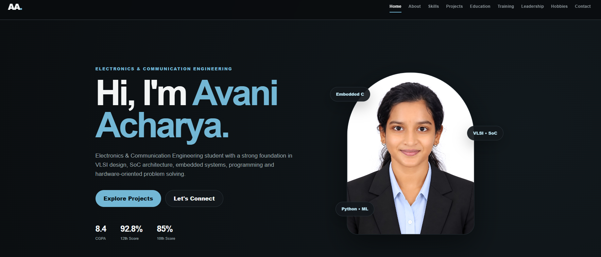

<p align="center">
  
</p>
<h1 align="center">Avani Acharya</h1>

<p align="center">
  <strong>Electronics & Communication Engineering Student</strong>
</p>

<p align="center">
  VLSI • Embedded Systems • Digital Design • Hardware • Software
</p>

<p align="center">
  <a href="https://cold-fog-d7d0.acharyavani05.workers.dev/">
    
  </a>
</p>

---

## About Me

Hi! I'm **Avani Acharya**, an Electronics & Communication Engineering student interested in the intersection of **hardware, embedded systems, VLSI, digital design, and software**.

I enjoy understanding how systems work from the hardware level and building practical solutions by combining electronics with programming.

This portfolio showcases my **projects, technical skills, education, training, leadership experiences, and creative interests**.

---

## Technical Skills

### Programming

`C` `C++` `Embedded C` `Python` `SQL`

### VLSI & Digital Design

`VLSI Design` `SoC Architecture` `Digital Circuit Design` `Xilinx Vivado` `Cadence`

### Embedded Systems

`Microcontrollers` `Embedded Firmware` `Interrupt-Driven Design` `Real-Time Processing` `Sensor Data`

### Software & Web

`HTML` `CSS` `Flask` `MySQL` `Docker` `AWS`

### Design & Tools

`Solid Edge` `VS Code` `Excel` `Photoshop` `Illustrator`

---

## Featured Projects

### Guardian Band

**Smart Wearable for Child, Women & Elderly Safety**

A microcontroller-based wearable safety system designed around real-time monitoring and emergency detection.

**Key Areas**

- Embedded system design
- Sensor data processing
- Interrupt-driven operation
- Fall detection
- Real-time safety alerts
- Hardware-software integration

**Technologies**

`Embedded C` `Microcontrollers` `Sensors` `Interrupts` `Real-Time Processing`

---

### Handwritten Notes Conversion System

An image-processing based system focused on converting handwritten notes into **digital, searchable, and editable text**.

**Key Areas**

- Image preprocessing
- Image enhancement
- Character recognition
- Text extraction
- Digital document generation

**Technologies**

`Python` `Image Processing` `Machine Learning` `Character Recognition`

---

## Education

| Qualification | Institution | Result |
|---|---|---|
| **B.E. — Electronics & Communication Engineering** | Mangalore Institute of Technology & Engineering | **CGPA: 8.4** |
| **12th — Senior Secondary** | Alva's P.U. College | **92.8%** |
| **10th — Secondary School** | M.K. Shetty Central School | **85%** |

---

## Training & Certifications

- **VLSI Training** — L&T
- **VLSI Design Fundamentals & SoC Architecture**
- **Hands-on VLSI Testing & Verification**
- **Embedded Hardware Design**
- **Fundamentals of Electromagnetics Concepts** — Ansys
- **Hands-on Exploration of Electromagnetics**
- **Object Oriented Programming** — NPTEL
- **Flask & Beyond: Docker to AWS**
- **24-Hour Hackathon** — IEEE

---

## Leadership & Activities

- **IEEE MTT-S Secretary**
- Hackathon leadership and participation
- Technical event coordination
- Class representation
- Technical quizzes and workshops
- Student event planning and coordination

These experiences have helped develop skills in **teamwork, communication, coordination, leadership, and problem solving**.

---

## Creative Interests

Beyond technology, I enjoy exploring creative activities.

**Sketching • Painting • Dancing • Artistic Crafting**

My portfolio also reflects this creative side through my artwork and personal interests.

---

## Languages

- English — Fluent
- Kannada — Fluent
- Tulu — Fluent
- Hindi — Conversational
- Japanese — Basic Conversational

---

## Portfolio Features

The website includes:

- Responsive design
- Interactive navigation
- About section
- Technical skills showcase
- Project presentation
- Education timeline
- Training & certifications
- Leadership experience
- Creative interests
- Contact information
- Mobile-friendly layout

---

## Live Website

<p align="center">
  <a href="https://cold-fog-d7d0.acharyavani05.workers.dev/">
    <strong>🌐 Visit Avani's Portfolio</strong>
  </a>
</p>

---

## Repository Structure

```text
my-portfolio/
│
├── assets/
│   ├── avani.jpg
│   └── portfolio-preview.png
│
├── index.html
├── script.js
├── style.css
└── README.md
